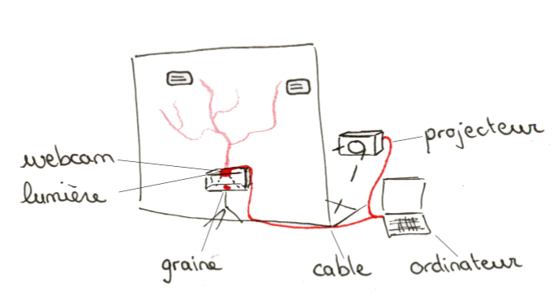
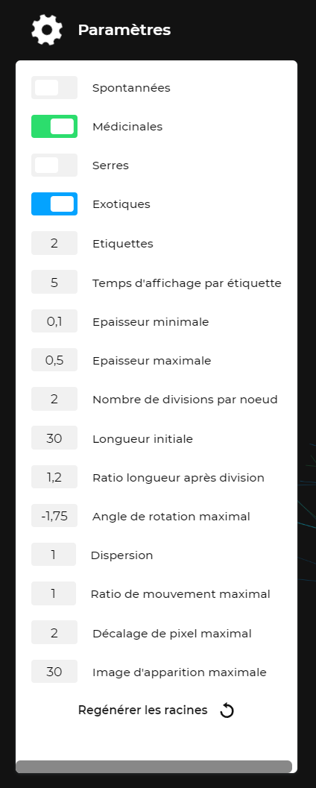

# LIU

- Partenaire : Jardin des Plantes de Nantes
- Etudiants
  - Emeline Rouxel
  - Ambre Senlis
  - Mathéo Lesage
  - Simon Wellenreiter
  - Ximeng Zhang
  - Johan Sorette
- Technologie d'entrée : Webcam
- Technologie de sortie : Projection immersive

# Prends-en de la graine

Site de démonstration disponible via https://icreate.johansorette.com/.

## Qu'est-ce que c'est ?

C'est un projet que nous avons réalisé lors du concours iCreate 2019 se déroulant sur 2 semaines et réunissant 3 écoles Nantaises : Polytech, l'EDNA (Ecole du design Nantes Atlantique) et Audencia SciencesCom.

L'objectif de ce concours était de collaborer avec différents corps de métiers (développeurs et designers), de mettre en application nos connaissances et de travailler en groupe sur un projet créatif pouvant mener jusqu'à une réelle exposition de l'installation dans les locaux des porteurs de projet.

5 contraintes nous ont été imposées en début de projet : 
1. Une webcam en technologie d'entrée. :white_check_mark: 
2. Une projection immersive en sortie. :white_check_mark: 
3. Un budget de 55€ :white_check_mark: 
4. Une installation de dimension 2,5m x 2,5m maximum :-1: 
(Bon, on va dire que le projecteur ne compte pas.. :wink:)
6. Permettre aux visiteurs du Jardin des Plantes de Nantes de découvrir son ampleur en terme d'échange de graines de plantes à l'international, tout ça à travers notre installation. :white_check_mark:

Nous avons alors opté pour une installation où l'on invite l'utilisateur/visiteur à devenir lui-même récolteur de graines (d'où le nom "Prends-en de la graine") et à les partager avec le monde entier. Ci-contre le schéma de l'installation :

Afin de simuler la récolte des graines, nous avons opté pour 4 cagettes contenant chacune une plante (représentant les 4 types de graines exportées : médicinales, spontannées, éxotiques et serres) et des graines de couleur au pied de la plante.

L'utilisateur peut ainsi prendre une ou plusieurs graines et les placer dans une boîte que l'on considère comme une "boîte aux lettres" à partir de laquelle on va pouvoir échanger avec le monde. Dès que les graines sont déposées, un réseau racinaire part de la boîte et s'étend sur le mur.

Ces racines réprésentent les graines exportées par le Jardin des Plantes du même type de plante que la ou les graines précédement déposées dans la boîte. Aux extrémités de certaines racines (de manière aléatoire), on retrouve également une étiquette avec des informations sur le jardin récepteur.

## Comment ça marche ?

A l'intérieur de la boîte, il y a en réalité une webcam, reliée biensûr à notre application web qui va détecter la couleur des graines grâce à la librairie [tracking.js](https://trackingjs.com/).

Dès qu'une couleur est détectée, nous générons le graphisme des racines, en fonction des données associées au type de la plante (cf. [Données de l'application](#Données-de-l'application)) et l'affichons grâce au projecteur. Pour cette partie graphique, nous avons opté pour la librairie [p5.js](https://p5js.org/) qui s'appuie sur les mêmes concepts que [Processing](Processing) mais avec JavaScript au lieu de Java.

### Données de l'application
Le porteur de projet du Jardin des Plantes nous a fourni quelques fichiers excel concernant les exportations et les importations de graines des années précédentes. Toutes ces données n'étaient malheureusement pas toutes exploitables car il manquait trop d'informations, notamment au niveau de l'importation. Nous avons alors décidé de se focaliser sur l'exportation du jardin avec les données sur les destinations et les graines envoyées : 
- Nom
- Pays
- Ville
- Nombre de graines médicinales
- Nombre de graines spontannées
- Nombre de graines éxotiques
- Nombre de graines serres

Nous avons filtré puis extrait ces données en format JSON afin de l'intégrer facilement au reste de l'application.

Cependant, il nous manquait encore une information importante : la localisation des destinations, afin que les racines/destinations soient triées par rapport à la longitude de leurs pays, ce qui apporte une certaine logique spatiale au réseau racinaire. Pour ça, nous avons trouvé un site internet nous permettant de lui passer en entrée la liste des villes et des pays, et nous retournant les longitudes/latitudes correspondantes.

## Guide de réalisation et d’installation du projet

### Matériel nécessaire
1. Une webcam USB
2. Un ordinateur
3. Un vidéo projecteur
4. 4 cagettes
5. 4 plantes différentes représentant les 4 types de plantes : médicinales, spontannées, éxotiques, serres
6. Des graines de 4 couleurs différentes : jaune, rouge, bleu, vert
7. Une paroi de 2,5m x 2,5m laissant suffisament passer la lumière du projecteur par l'arrière
8. Une boîte à chaussures
9. Une petite source de lumière (LED, lampe, ou autre) sera aussi à prévoir suivant la luminosité du lieu d'installation, afin de favoriser la détection de la couleur des graines au niveau de la boîte.

### Logiciels nécessaires et procédure d'installation
Equipez-vous d'un environnement [Node.js](https://nodejs.org/).

Puis, clonez ce dépôt GitHub avec la commande suivante : 
`git clone https://github.com/mperreir/iCreate2019.git`

Placez-vous à la racine du projet de notre équipe Liu : 
`cd iCreate2019/jardin-des-plantes/Liu/`

Installez les dépendances de l'application :
`npm install`

### Procédure de montage et de lancement du projet
#### Installation du matériel
La webcam et le vidéo projecteur devront être réliés à l'ordinateur respectivement via un câble USB et un HDMI/VGA.

#### Lancement du serveur
Pour lancer le serveur en local sur votre machine, exécutez :
`npm start`

Votre navigateur par défaut devrait ainsi ouvrir directement une fenêtre vers l'application. Si ce n'est pas le cas, vous pouvez toujours y accéder via l'url http://localhost:3000.

## Paramétrer l'application
Une fois sur l'application, vous avez accès à un menu (en haut à gauche) vous permettant de paramétrer la génération des racines, les étiquettes d'information sur les destinations, d'activer/désactiver la webcam et même de sélectionner manuellement les types de plantes à afficher.

Il est également possible de rendre ce menu invisible, en exécutant la commande suivante dans la console de votre navigateur : 
`toggleSettingsVisibility()`