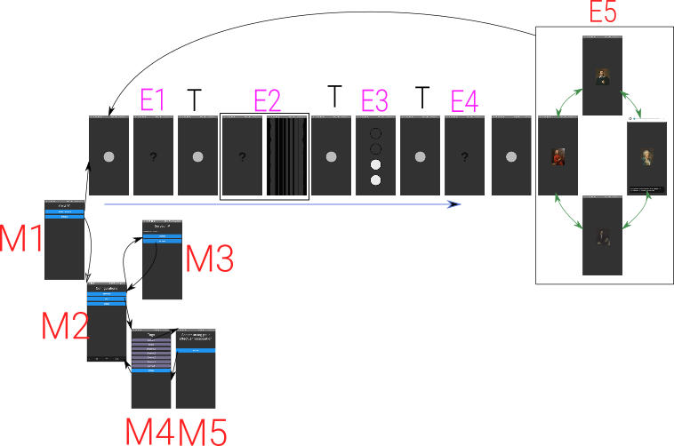

# Application

Ce dossier contient l'application de notre projet.
Celle-çi permet également de configurer les tags et le serveur à utiliser pour l'escape game.

L'application gère chaque énigme comme une sous vues avec ses propres événements, chaque énigmes se situent dans le dossier components/enigmas.

Vous pouvez également consultez ce schéma pour avoir un aperçu des vues, et les fichiers qui leurs correspondent.

- T : [vue de transition](https://github.com/CuadrosNicolas/ICreate2019-1/blob/master/SM_ART/components/breathingView.js)
- M1-M5 : [menus](https://github.com/CuadrosNicolas/ICreate2019-1/blob/master/SM_ART/menuView.js)
- E1 : [Enigme de luminosité](https://github.com/CuadrosNicolas/ICreate2019-1/blob/master/SM_ART/components/enigmas/lumenView.js)
- E2 : [Enigme de la guitare](https://github.com/CuadrosNicolas/ICreate2019-1/blob/master/SM_ART/components/enigmas/guitarView.js)
- E3 : [Enigme de la chasse et des tags](https://github.com/CuadrosNicolas/ICreate2019-1/blob/master/SM_ART/components/enigmas/fillingCircleView.js)
- E4 : [Enigme du cadenas](https://github.com/CuadrosNicolas/ICreate2019-1/blob/master/SM_ART/components/enigmas/soundView.js)
- E5 : [Enigme des portraits](https://github.com/CuadrosNicolas/ICreate2019-1/blob/master/SM_ART/components/enigmas/swaperView.js)